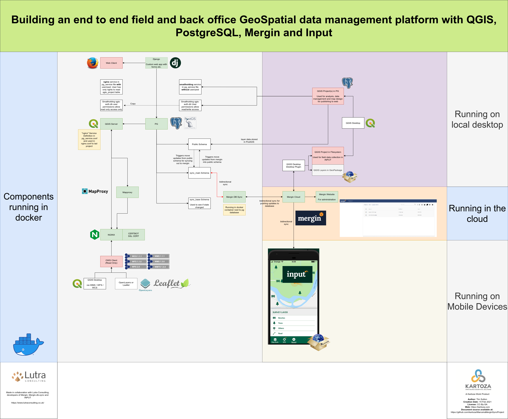

# Introduction

This project provides a platform for creating, sharing and publishing data and maps using an Open Source GIS Stack. It has two primary objectives:

1. Provide a platform that integrates these technologies:
   1. One or more [QGIS](https://qgis.org) Projects
      1. Projects stored in-database in PostgreSQL
      2. Projects stored in the file system
   2. QGIS Server
      1. Publishing projects stored on the files system
      2. Publishing projects stored in the database
   3. Field data collection and project synchronisation support:
      1. The [Mergin](https://public.cloudmergin.com/#) platform for cloud storage of projects
      2. The [INPUT](https://inputapp.io/en/) mobile data collection platform
      3. The [Mergin-db-sync](https://github.com/lutraconsulting/mergin-db-sync) tool that will synchronise a Mergin cloud project into a PostgreSQL project.
   6. [PostgreSQL](https://postgresql.org) and [PostGIS](https://postgis.net/) running in Docker and providing a database backend for our stack.
   7. [NGINX](https://www.nginx.com/) a lightweight web server acting as a proxy in front of QGIS server and as a server for the static HTML content.
   8. [QGIS Server](https://docs.qgis.org/3.16/en/docs/) to serve QGIS projects from the database and from the file system.
   9. [QGIS Server Docker Image](https://github.com/gem/oq-qgis-server) from OpenQuake.
   10. [Apache Superset](https://superset.apache.org/) to provide dashboard visualisations

These projects are independent from the Opsn Source GIS Stack project and any issues encountered using these applications should be raised with the appropriate upstream project.

## Overview Diagram

