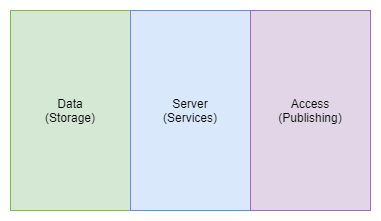
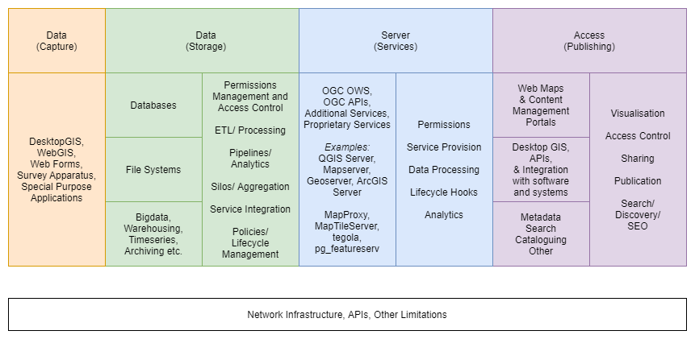
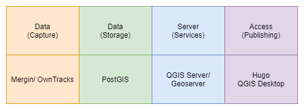
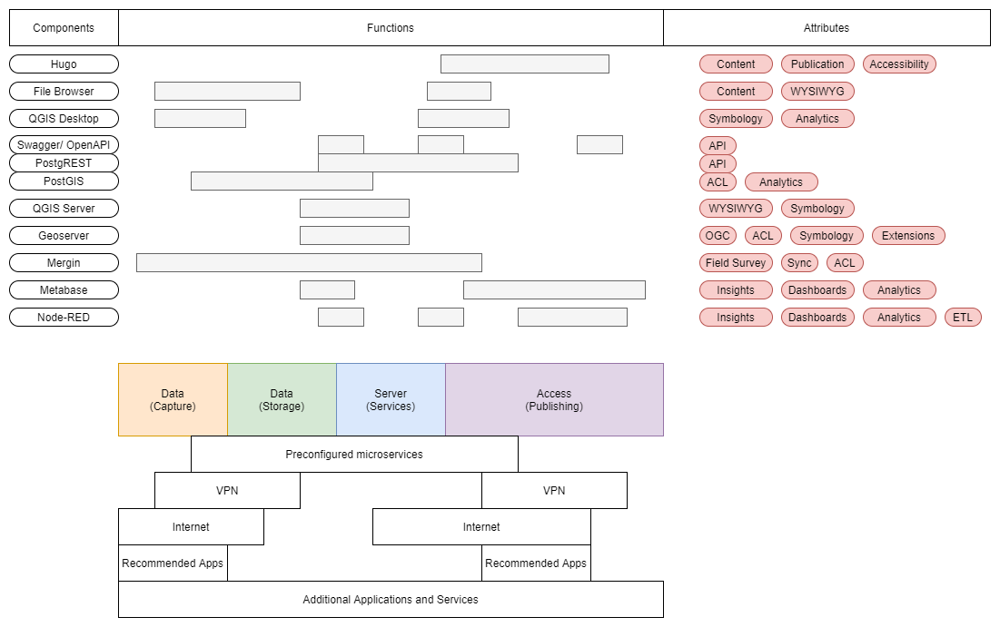
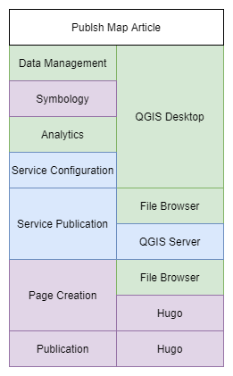

# About Spatial Infrastructures

Spatial Infrastructures refers to the infrastructure that supports spatial applications.

Although typically the implementation of spatial applications is done using what is known as an "SDI", or Spatial _Data_ Infrastructure, the term "Spatial Infrastructures" is used in this context as a broader term to describe the infrastructure that supports spatial applications beyond the management, manipulation, and analysis of spatial data. This extends to the publication and discovery of outputs which leverage spatial data, as well as the integration of spatial services with additional resources to provide business intelligence and analytics.

## Categories

SDIs typically involve the utilisation and integration of various components to perform some specific function or role.

These components can usually be segregated into three categories:

- Data
- Services
- Access

_Basic Spatial Infrastructure component categories:_

In it's most basic form, GIS could involve access to data using a Desktop GIS to access some data, stored on the local file system. In such an instance, server based services are excluded. Users may also produce map outputs and publish them to a service such as a website.

As functionality increases, so more components must be added. So an enterprise database could be provisioned for multiple users to edit and manipulate data from a single canonical source. This database could be exposed to a map server which provides a geospatial service endpoint. That endpoint could be consumed by a web application which provides a web based interface to the data, allowing the latest data updates to remain available to data consumers.

## Complexity

Of course the descriptions above are simplistic and are relevant to basic implementations, however they would still require an end user to have the necessary skill to implement and maintain a web service, database, and geospatial server application.

As the amount of users, available data, applications, or required insights grows, so does the complexity of the system, with real life implementation or practical examples resembling the following illustrating much more closely than the example above.

_Example components in more complex Spatial Infrastructure systems:_

In addition to this, within or between any of these components, additional complexity may be introduced by various operational processes, such as additional analysis, integration, management, auditing, or production of derivative components or products.

On top of that, various business processes, such as quality assurance, security operations, or approval workflows may be required.

The network infrastructure also needs to be managed effectively to ensure that users who need access to services are able to attain it, and that all services and processes are able to communicate.

Spatial components offer deep insights and analysis which is not attainable by other means. This is at the cost of complexity, as in order to do so there needs to be provision for storage of vector and geometry information, spatial analysis tools, new and complex data types, large data sources such as satellite imagery, standards compliant services, and so on.

In a nutshell, Spatial Infrastructures are complex, and are certainly non-trivial to implement and maintain.

## OSGS

So where does the Open Source Geospatial Stack fit in to this?

The first step would be to identify which components are needed for performing particular tasks or achieving certain outcomes. OSGS is particularly awesome because it provides processes, workflows, or solutions to common problems that can be easily replicated or extended (but more on that later).

The next challenge would be selecting the correct technology for each component. As OSGS is opinionated, the second hurdle is handled by default.

The next step would be to configure the various technologies and components into an integrated environment that allows them to communicate effectively and facilitates users actually doing work. This is, in many instances, by far the most complex and difficult task, and typically requires expertise in solution architecture, system administration and management, geospatial expertise, and knowledge of the individual applications and their implementation strategies.

The primary goal of OSGS is to take this (rather complex) step, and reduce it to `git clone https://github.com/kartoza/osgs/` and `make configure`.

_A basic example OSGS implementation:_

Of course, under the hood, OSGS is handling a lot of complexity, configuration, and decision making. The illustration below shows the core components of OSGS, and the functionalities they provide across the various categories required to implement and extend a Spatial Infrastructure, along with the application specific attributes or particular areas of interest that applications are intended for use.

_Note that this illustration is provided for illustrative purposes only, and uses only emperical estimates. No actual measurement of fucntionality took place. A subset of services has been illustrated and this is not comprehensive by any means_

## OSGS Processes

For end users, this complexity is likely overwhelming. That's ok, and it's exactly why OSGS was created in the first place.

The main idea behind OSGS is to take all of this complexity illustrated above, and condense it into application-specific, user-centric workflows and processes.

The following illustration outlines the process behind publication of a map as a service and it's integration into an article on the main site, and the various stack components that are involved.

The result is that users can simply achieve their goals by following a simple process, such as making and uploading a map, then adding it to an article with simple markdown, and leave the complexity involved in these processes to be handled by the stack.
