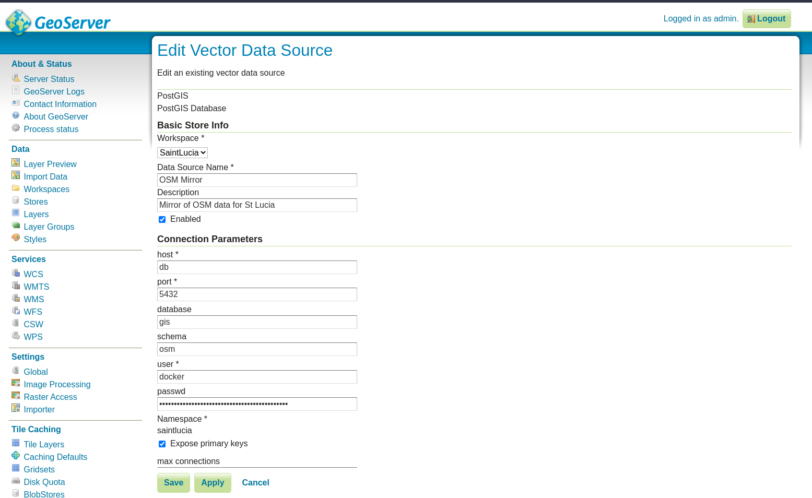

# Docker OSM mirror 

OpenStreetMap (OSM) is a digital map database of the world built through crowdsourced volunteered geographic information. The data from OSM is freely available for visualization, query, download, and modification under [open licenses](https://www.openstreetmap.org/copyright). [[1]](#1) OSM can also be described as a free, editable map of the whole world [[2]](#2).

The Docker OSM mirror service is a docker compose project to setup an OSM PostGIS database with automatic updates from OSM periodically. The only files you need is a PBF file, geojson (if you intend to restrict data download to a smaller extent than the one specified by the PBF) and run the docker compose project.[[3]](#3)

The Docker OSM mirror service is composed of Docker ImpOSM3, Docker OSM Update and Docker OSM enrich. Docker ImpOSM3 takes the PBF file and imports it into the PostGIS OSM database. It will also apply any new diff file that arrives to the database. Docker OSM update runs every few minutes and regualarly fetches any new diff file for all the changes that have happened over the update interval from OpenStreetMap and applies any new features to your existing PostGIS OSM database. OSM enrich goes to the OSM API and gets the username and last change timestamp for each feature.[[3]](#3)


**Service name:** osm-mirror

**Project Website:** [OpenStreetMap](https://www.openstreetmap.org/)

**Project Source Repository:** [openstreetmap / openstreetmap-website](https://github.com/openstreetmap/openstreetmap-website)

**Project Technical Documentation:** [OpenStreetMap Getting Help](openstreetmap.org/help)

**Docker Repository:** [kartoza/docker-osm](https://hub.docker.com/r/kartoza/docker-osm)

**Docker Source Repository:** [kartoza / docker-osm](https://github.com/kartoza/docker-osm)

## Deployment

```
make deploy-osm-mirror
```

## Enabling

```
make enable-osm-mirror
```

## Configuration

```
make configure-osm-mirror
```


## Starting

```
make start-osm-mirror   
```

## Stopping

```
make stop-osm-mirror   
```

## Disabling

```
make disable-osm-mirror
```

## Reinitialising 

```
make reinitialise-osm-mirror
```

## Creating a vector tiles store from the docker osm schema

``` 
make osm-to-mbtiles
```

## Logs

```
make osm-mirror-logs
```

## Shell

```
make osm-mirror-osmupdate-shell

make osm-mirror-imposm-shell
```

## Accessing the running services


## Additional Notes


The OSM mirror uses the kartoza/docker-osm tool to create an in-database
mirror of a designated geographical area in the designated postgres
databse schema (set to: osm). The OSM mirror tool is described in the project
README here:

https://github.com/kartoza/docker-osm

To deploy the docker-mirror you need to follow the steps descibed below. 
First a process overview:

1. Create the PBF feature container passing it a URL to a PBF file
2. Create a clip file that will be used to constrain any retrieved / imported
   data to a specific geographic area.
3. Tweak the mappings.yml file (advanced users)
4. Run the docker-osm service
5. Optionally include these data in published services via QGIS projects, 
   GeoServer etc.

### PBF Container

During the ``make configure`` process, the script will ask for the URL
to an OSM .pbf file e.g.:

```
------------------------------------------------------------------
Fetching pbf if not cached and then copying to settings dir
------------------------------------------------------------------
URL For Country PBF File: https://download.geofabrik.de/central-america-latest.osm.pbf
```

You can enter any valid URL for an OSM .PBF file at this point. A docker
container will be built that fetches the PBD and stores it on the host 
file system under osm_config.

### Clip Area

Create the clip area to constrain the geographical region that data 
will be harvested for. For best performance, a simple rectangle is best,
but any complext polygon can be used. The clip area must be saved 
as ``osm_config/clip.geojson``. The format for the clip area must be 
GeoJSON. You can easily create this using QGIS.

### Mappings

For advanced users, you can tweak the ``osm_config/mapping.yml`` 


You can see how the imposm3 mapping syntax works here: 

https://imposm.org/docs/imposm3/latest/mapping.html

Note that you cannot alter the mappings after the service is running without
clearing the databse and restarting the import.

### Run services

To run the OSM services do:

```docker-compose --profile=osm up -d```

### Publishing with GeoServer

You can publish the data in the osm schema using GeoServer or 
by publishing a QGIS project that references the data layers in
the OSM schema.

The steps for publishing with GeoServer are quite simple:

1. Log in to GeoServer using the 'admin' user and the password in 
   .env.
2. Create a new store of type 'Postgis' and configure it as per the
   screenshot below, replacing the password with the Postgres password
   stored in .env:

   

   Also, be sure to scroll down and set SSL mode to Required:

   


3. Register one or more layers from that store as per the image below:
   
   

4.Complete the layer details as appropriate and make sure to click the options highlighted in red in the screenshot below:

   
   

1. Connect to the GeoServer from a client e.g. QGIS using WFS or WMS using the scheme:

https://example.org/geoserver/SaintLucia/wfs

or

https://example.org/geoserver/SaintLucia/wms

   


### Publishing with QGIS Server

The workflows described in the section on working with the PostgreSQL database below are basically all you need to know, so we don't repeat that here, other than to remind you that hte OSM mirrored data is by default stored in a schema called 'osm'.

### OSM Attribution

Note that whenever you publish a map containing OSM data, be
careful to adhere to the license and credit the OSM Project as
per:

https://www.openstreetmap.org/copyright


## References

<a id="1">[1]</a> Quinn, S., & Dutton, J. A. (n.d.). OpenStreetMap and its use as open data | GEOG 585: Web Mapping. GEOG 585 Open Web Mapping. Retrieved August 30, 2021, from https://www.e-education.psu.edu/geog585/node/738


<a id="2">[2]</a> About OpenStreetMap - OpenStreetMap Wiki. (n.d.). OpenStreetMap Wiki. Retrieved August 30, 2021, from https://wiki.openstreetmap.org/wiki/About_OpenStreetMap

<a id="3">[3]</a> Kartoza. (n.d.). GitHub - kartoza/docker-osm: A docker compose project to setup an OSM PostGIS database with automatic updates from OSM periodically. GitHub. Retrieved August 30, 2021, from https://github.com/kartoza/docker-osm#readme
