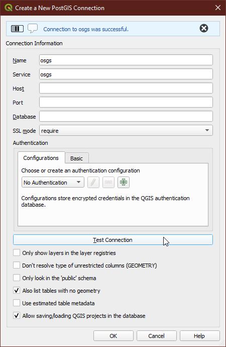
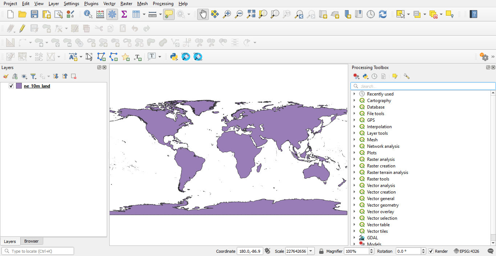
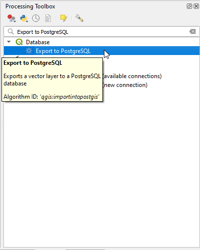
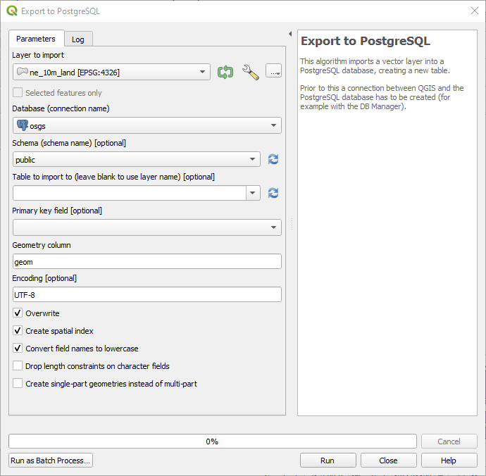
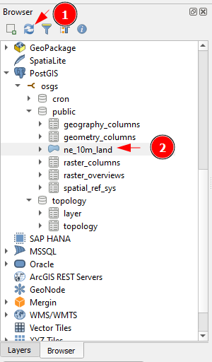
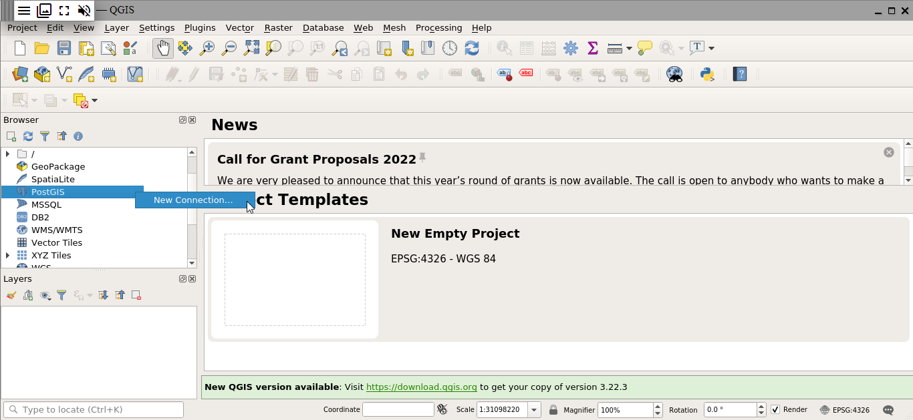
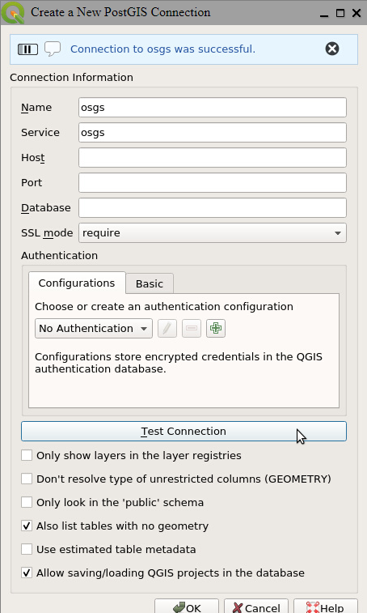

# Accessing PostGIS from QGIS using a pg_service file

## Deploy the initial stack

In your terminal, after [project checkout](../installation/initial_configuration.md##Project-Checkout), deploy the initial stack by running either `make configure-ssl-self-signed` or `make configure-letsencrypt-ssl`. The initial stack consists of the Nginx, Hugo Watcher and Watchtower services.

Use `make configure-ssl-self-signed` if you are going to use a self-signed certificate on a localhost for testing. Use `make configure-letsencrypt-ssl` if you are going to use a Let's Encrypt signed certificate on a name host for production. The `make configure-ssl-self-signed` will deploy the Nginx, Hugo Watcher and Watchtower services, but after running `make configure-letsencrypt-ssl` you will need to run `make deploy-hugo` to deploy the Nginx, Hugo Watcher and Watchtower services.

Use `make ps` to view the services running. The following services should be up:


## Deploy the PostgreSQL and PostGIS service

Deploy the PostgreSQL and  PostGIS service using `make deploy-postgres`. If you already have PostgreSQL installed on your local machine, ensure that you specify a different port number for the Postgis Public Port other than port 5432, the default port for PostgreSQL. For example, you can use the port number 5434.


Use `make ps` to view the services running. The following services should be up:


The PostgreSQL and PostGIS service has the following databases: 


In this workflow, you will be connecting to the `gis` database.

## Using the pg_service file on the client side of the stack (where it references the external port)

### Creating your local connection service file

On your local machine, the per-user connection service file can be at `~/.pg_service.conf` or the location specified by the environment variable `PGSERVICEFILE`.  Add a service to this connection service file with the following service name and connection parameters. 
```
[osgs]
dbname=gis
user=docker
port=<POSTGRES_PUBLIC_PORT>
password=<POSTGRES_PASSWORD>
host=
sslmode=require
``` 
For the port and password connection parameters, use the `POSTGRES_PUBLIC_PORT` and  `POSTGRES_PASSWORD` specified in the `.env` file. For the host connection parameter, use the hostname of the server where you have set up OSGS.

For more information on the PostgreSQL connection service file see the [PostgreSQL documentation](https://www.postgresql.org/docs/current/libpq-pgservice.html).

### Setting up your PostGIS connection in QGIS (locally)

QGIS Desktop can be downloaded from [here](https://qgis.org/en/site/forusers/download.html) and installed using [these instructions](https://qgis.org/en/site/forusers/alldownloads.html).

On your local machine, open QGIS Desktop.  In your Browser Panel,  right click on the PostGIS option and click on "New Connection". This will open the Create a New PostGIS Connection dialogue. 


In the Connection Information section, give the connection an appropriate name. For the service and port enter the service name and port number, that you specified in the connection service file. Set the SSL mode to `require` and ensure you have enabled the `Also list tables with no geometry` and the `Allow saving/loading QGIS projects in database` options. Click on "Test Connection". Once you see the `Connection to <Name> was successful` message, click "OK". You have now successfully connected to the PostgreSQL and PostGIS service `gis` database. 



### Loading data into the `gis` database

There are multiple ways to load vector data into a PostGIS database. Some of them are:
* using the PgAdmin Browser
* using the ogr2ogr commandline utility
* using the shp2pgsql conversion utility
* using the QGIS DB Manager
* using the "Export to PostgreSQL" Database option from the Processing Toolbox in QGIS. 
* using the "Export to PostgreSQL" GDAL options in QGIS. 
  
To load raster data into a PostGIS database some of the tools you can use are the:
* the PgAdmin Browser
* the raster2pgsql conversion tool

In this workflow, you will be using the "Export to PostgreSQL" Database option from the Processing Toolbox in QGIS to export a vector layer from QGIS to the `gis` database, creating a new relation.

First, download the Natural Earth Land dataset from this [link](https://www.naturalearthdata.com/http//www.naturalearthdata.com/download/10m/physical/ne_10m_land.zip). Unzip the downloaded `ne_10m_land.zip` file then drag and drop the `ne_10m_land.shp` shapefile into QGIS. 



In the Processing Toolbox Panel, search for the "Export to PostgreSQL" option and double-click on the result in the Database category.



In the Export to PostgreSQL dialogue specify the following parameters and click "Run". Each of these parameters is described in depth [here](https://docs.qgis.org/3.16/en/docs/user_manual/processing_algs/qgis/database.html#export-to-postgresql). 



Once the export is done, you should see an `Algorithm 'Export to PostgreSQL' finished` message in the Log. In the Browser Panel, click on Refresh. You will see the `ne_10m_land` table in the `public` schema.



## Using the pg_service file on the server side of the stack (where it references the internal port)

### Creating the server-side connection service file

To create the server-side connection service file, run the command `cp conf/pg_conf/pg_service.conf.example conf/pg_conf/pg_service.conf` in the terminal. In the `conf/pg_conf/pg_service.conf` file, add a service with the same name as the service you set up on your local machine. The service should have the following service name and connection parameters. 
```
[osgs]
dbname=gis
user=docker
port=5432
password=<POSTGRES_PASSWORD>
host=db
sslmode=require
```
For the port and password connection parameters, use the `POSTGRES_PRIVATE_PORT` and `POSTGRES_PASSWORD` specified in the `.env` file. For the host connection parameter use the name `db` which is the name of the Postgres service docker profile.

For more information on the PostgreSQL connection service file see the [PostgreSQL documentation](https://www.postgresql.org/docs/current/libpq-pgservice.html).


### Setting up your PostGIS connection in the QGIS-Desktop service

Deploy the QGIS Desktop service using `make deploy-qgis-dekstop`. Use `make ps` to view the services running. The following services should be up:


The QGIS Desktop service is now accessible on `/qgis-desktop/` e.g. `https://localhost/qgis-desktop/`. Log in to the service using the username `<NGINX_AUTH_USER>` and password `<NGINX_AUTH_PWD>` specified in the `.env` file. 

In your Browser Panel,  right click on the PostGIS option and click on "New Connection". This will open the Create a New PostGIS Connection dialogue. 



In the Connection Information section, give the connection an appropriate name. For the service and port enter the service name and port number, that you specified in the connection service file. Set the SSL mode to `require` and ensure you have enabled the `Also list tables with no geometry` and the `Allow saving/loading QGIS projects in database` options. Click on "Test Connection". Once you see the `Connection to <Name> was successful` message, click "OK". You have now successfully connected to the PostgreSQL and PostGIS service `gis` database. 



In your Browser Panel click on Refresh. You will see under the PostGIS option our new PostGIS connection. In the public schema you will find the `ne_10m_land` table which we added in the previous [section](#loading-data-into-the-gis-database). Double click on the table to add it as a vector layer in QGIS. 

