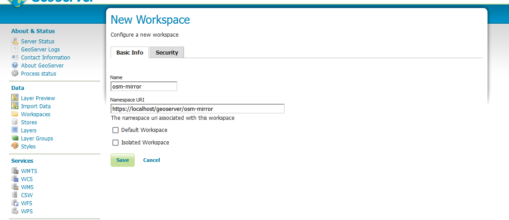
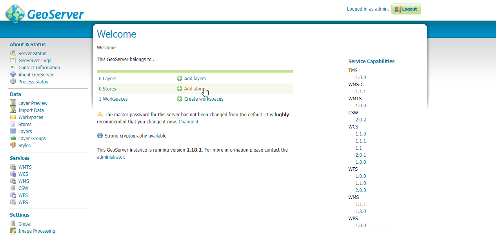
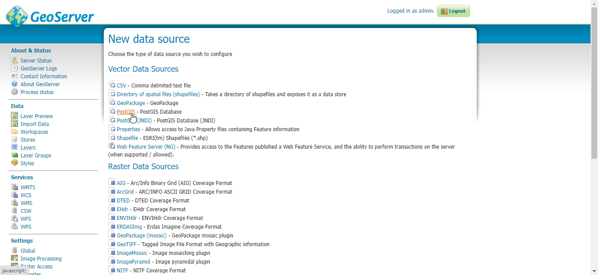
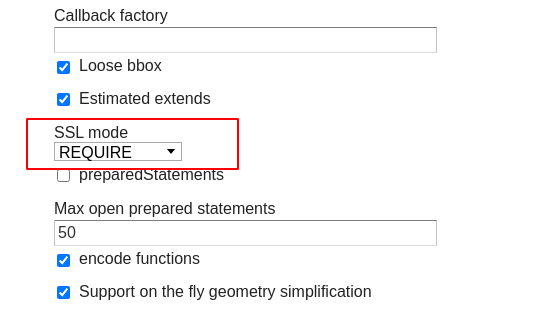
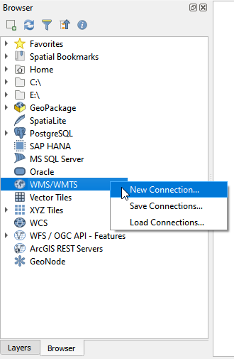
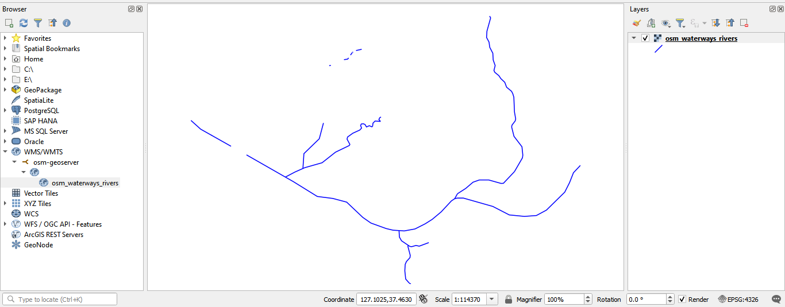

# Publishing layers using GeoServer

In this workflow, you will publish the `osm_waterways_rivers` OpenStreetMap layer in the `osm` schema of the Postgres service `gis` database. 

## Deploy GeoServer

### Deploy the OSM Mirror service

Deploy the OSM mirror service using the instructions detailed in the [Creating an Open Street Map mirror into your database workflow](https://kartoza.github.io/osgs/workflows/create-osm-mirror-in-database.html).

### Deploy the GeoServer service

Deploy the GeoServer service using `make deploy-geoserver`. The service is now accessible on `/geoserver/` e.g. `https://localhost/geoserver/`. Use the `<GEOSERVER_ADMIN_USER>` and `<GEOSERVER_ADMIN_PASSWORD>` specified in the `.env` file to sign into GeoServer.  

## Publishing with GeoServer

### Create a new workspace 

After signing in, there will be 3 options on the Welcome webpage: "Add layers", "Add stores", or "Create workspaces". Click on "Create Workspaces".


Name the new workspace `osm-mirror`. For the Namespace URI, use the format `https://<server>/geoserver/osm-mirror/` with the server parameter being the hostname of the server where you set up OSGS.



Check/uncheck checkboxes in the Security tab to set data access rules at the workspace level as required.


Once you are done defining your new workspace, click "Save".

### Create a new data store

Return to the Welcome page and click on the plus icon with "Add store" next to it.



In the Vector Data Source category, select "PostGIS - PostGIS Database".



In GeoServer, every PostGIS store must be connected with just one schema. In this workflow, you will publish the `osm_waterways_rivers` layer which is in the `osm` schema hence you will create a vector data store in the `osm-mirror` workspace connected to the `osm` schema.

Name your new vector data source `gis-osm`. For the connection parameters, specify the following:

```
host : db
port : 5432
database : gis
schema : osm
user : <POSTGRES_USER>
passwd : <POSTGRES_PASSWORD>
```

The `<POSTGRES_USER>` and `<POSTGRES_PASSWORD>` are specified in the `.env` file.


Also, be sure to scroll down and set the SSL mode to `REQUIRE` then click on "SAVE".



From the list of layers in the New Layer page, search for the `osm_waterways_rivers` layer using the search bar and click on "Publish".


Complete the layer details as appropriate and make sure to click the options highlighted in red in the image below. Click on "Save" once you are finished.


## View published layer in QGIS

You can connect to the GeoServer from QGIS using WFS or WMS using the scheme: `https://<server>/GeoServer/<workspace>/wfs` or `https://<server>/GeoServer/<workspace>/wms` where `<server>` is the hostname of the server where OSGS is set up and `<workspace>` is the name of the workspace you created in the previous steps.

In your QGIS Desktop Browser Panel, right click on the WMS/WMTS option and click on New Connection.



Give the connection an appropriate and set the URL using the WMS schema as shown below. Click on "OK".


To view the layer, add the Layer to the QGIS Map View.


