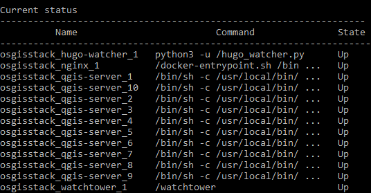
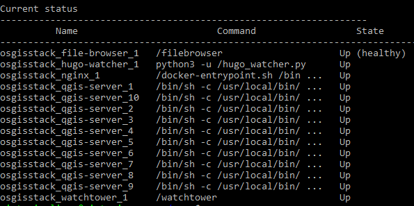
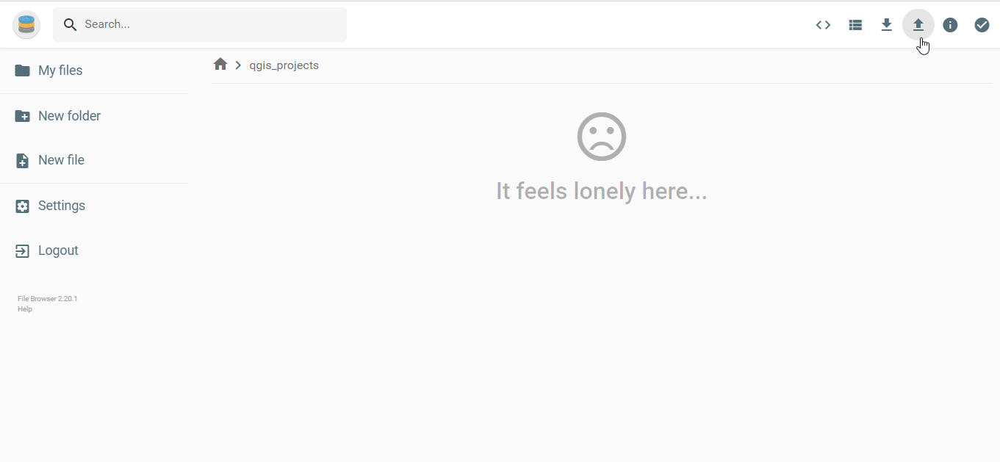
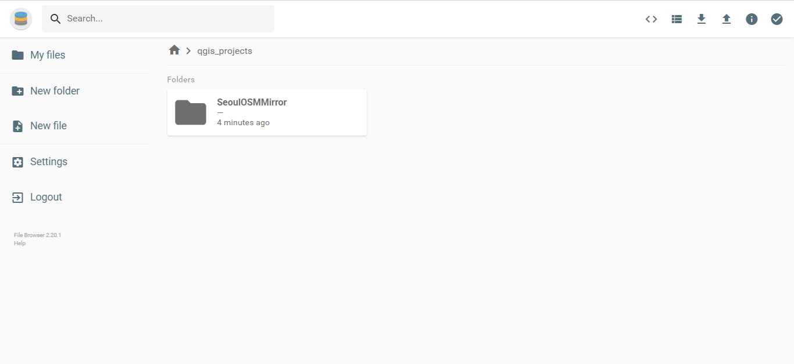
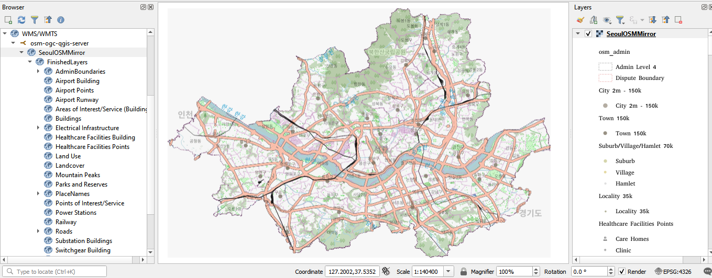

# Uploading a QGIS project

This workflow demonstrates how to publish a QGIS project in a folder/directory.

The vector data used in this workflow was acquired from OpenStreetMap using the [Docker OSM mirror service](https://kartoza.github.io/osgs/services/docker-osm.html) using the [Creating an Open Street Map mirror into your database](https://kartoza.github.io/osgs/workflows/create-osm-mirror-in-database.html) workflow. The layers were then exported from the Postgres service `gis` database into a GeoPackage using the ogr2ogr tool. The `clip.geojson` file used to get the OpenStreetMap data for Seoul, South Korea, was obtained from the[southkorea/seoul-maps](https://github.com/southkorea/seoul-maps/blob/master/juso/2015/json/seoul_municipalities_geo_simple.json) repository.

## Deploy the initial stack and the QGIS Server service

In your server terminal, deploy the initial stack by running either `make configure-ssl-self-signed` or `make configure-letsencrypt-ssl`. The initial stack consists of the Nginx, Hugo Watcher and Watchtower services.

Use `make configure-ssl-self-signed` if you are going to use a self-signed certificate on a localhost for testing. Use `make configure-letsencrypt-ssl` if you are going to use a Let's Encrypt signed certificate on a name host for production. The `make configure-ssl-self-signed` will deploy the Nginx, Hugo Watcher and Watchtower services, but after running `make configure-letsencrypt-ssl` you will need to run `make deploy-hugo` to deploy the Nginx, Hugo Watcher and Watchtower services.

To deploy the QGIS Server Service, run `make deploy-qgis-server`. Use `make ps` to see the services running. The following services should be up:

## Prepare the QGIS project

Place the QGIS project file and its associated vector and/or raster data in a named directory that matches the name of the QGIS project file. In this workflow, the `SeoulOSMMirror.qgz` QGIS project file and the `SeoulOSMMirror.gpkg` GeoPackage file are in the directory `SeoulOSMMirror`.

## Deploy the File Browser service and upload the QGIS project

To deploy the File Browser service run `make deploy-file-browser`. The following services should be up:

The file browser service can now be accessed on `/files/` e.g. https://localhost/files. The URL will direct you to the Login page. Sign in to the service using the File Browser username `admin` and password `<FILEBROWSER_PASSWORD>` specified in the `.env` file.

Navigate into the `qgis_projects` folder, click on the upload button and upload the directory/folder containing the QGIS project file to be published.

Restart the QGIS Server service using `make restart-qgis-server`.

## Using QGIS Desktop as a web service client for QGIS Server published layers

We can now access the QGIS project on the OGC link. In your QGIS Desktop Browser panel, right click on the `WMS/WMTS` option and create a new connection.

Give the new connection an appropriate name. For the URL parameter, access the published QGIS project via `/ogc/SeoulOSMMirror` i.e. `https://<server name>/ogc/<QGIS project name>`.

Click "Ok". Once the connection is successful, drag and drop the `SeoulOSMMirror` layer onto the QGIS Map View.

